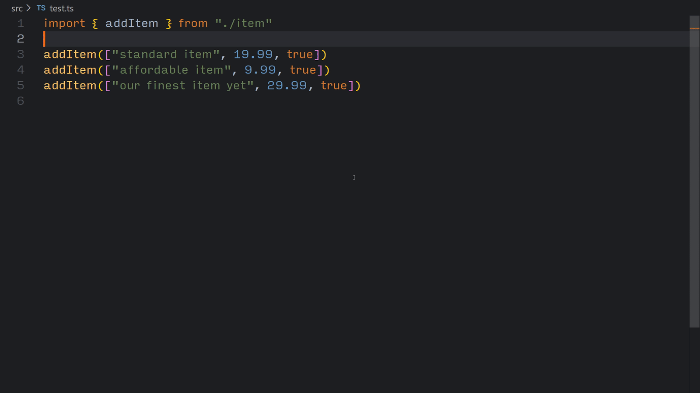
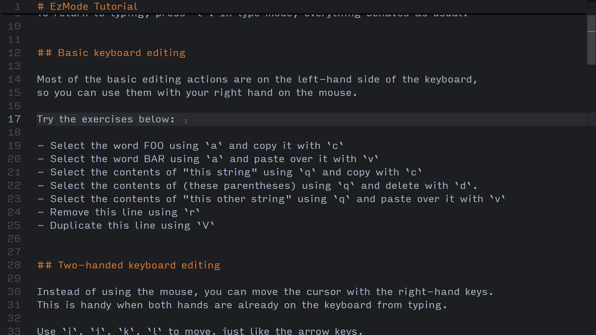
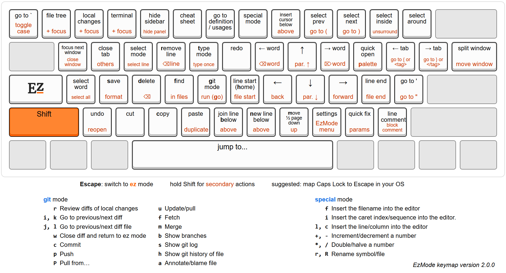

EzMode is a plugin for Visual Studio Code that brings the power of modal editing, without the steep learning curve.
Edit faster than ever, with or without a mouse.



One reason modal editing is so fast is that it reduces hand movement, such as reaching for arrow keys after typing. EzMode takes this further: when your right hand is on the mouse, you can still perform all essential editing actions without moving your left hand. This allows some really fast editing:



### Features

- Built for modern IDEs
- Tiny core, powerful actions
- Fully customizable modes and keybindings
- No Ctrl or Alt needed
- Git mode and diff navigation
- Built-in tutorial and cheat sheet

### What is modal editing?

It adds modes to your keyboard. In type mode, the `c` key types the letter `c`, but in EzMode it copies, and in git mode it commits.

### Keyboard layout


*[View on Keyboard Layout Editor](https://www.keyboard-layout-editor.com/#/gists/aee165d4c5c45849d72647829abe7038)*

All motion keys are on the right, so your right hand moves the cursor, whether on the keyboard or the mouse.

Common actions like copy/paste/undo/save are on the keys everyone already knows.

## Getting Started

1. Install the extension
2. Open the [tutorial](data/EzModeTutorial.md) in VS Code by clicking the mode indicator in the bottom-right corner.

## Customization

The full keymap is defined in [base.ezmoderc](data/base.ezmoderc),
which you can override with your own `.ezmoderc` file.

Key mappings use this format:

```
map {mode} {key} {actions}
```

### `mode`

The mode in which the key mapping is active. Built-in modes include `ez`, `type`, `select`, and `git`, but you can
define your own as well.

### `key`

The character that has to be "typed" to trigger the action. Naturally, uppercase means holding shift.

Ctrl/Alt shortcuts are not characters and are not handled by EzMode.

Special key values:

- `default`: The default key mapping, which will be triggered by any key that does not have a mapping for the given
  mode.
- `space`: The spacebar
- `enter`: The enter key
- `lt`: The `<` key
- `gt`: The `>` key
- `entermode`: Triggered when entering the mode
- `exitmode`: Triggered when exiting the mode

### `actions`

A string of one or more actions with no separators.

You can map an action to the parent keymap by typing its `key`,
or you can use base actions enclosed in angle brackets:

- `<vscode SomeCommandId>`: Invoke a VSCode command.
- `<mode somemode>`: Switch to a different mode
- `<write Hello world!>`: Insert a string into the editor
- `<popup Hello world!>`: Show a notification
- `<native>`: Insert the `key` into the editor
- `<ofmode somemode>`: Let another mode handle the same `key`
- `<set varname value>`: Set a custom variable to a value
- `<nothing>`: Do nothing

### Variables

In actions that take a text argument, you can use variables enclosed in `${}`,
for example: `<write Hello, ${filename}!>`.

- Custom variables: set in your config using `set varname value`
- Built-in variables: `mode`, `key`, `caretindex`, `line`, `column`, `selection`, `clipboard`, `filename`, `projectname`
- Escape sequences: `space`, `tab`, `nl` (newline), `doubleslash` (for `//`)

### Examples

Map `C` (Shift + c) in `ez` mode to select all (`A`) and copy (`c`):

```
map ez C Ac
```

Create a mode that types every character twice:

```
map doubletype default <native><native>
map ez X <mode doubletype>
```

More practical examples can be found in
the [.ezmoderc template](data/template.ezmoderc)

## Comparison with other modal editors

Compared to Vim or Kakoune, EzMode focuses on adding customizable modes without changing the editor's fundamental behavior. It doesn't change how copy/paste works, and it doesn't use a block cursor, only changing the cursor color to indicate mode.

EzMode avoids Ctrl and Alt entirely for ergonomics and simplicity. This makes it easier to learn and configure while preserving your existing editor shortcuts.

EzMode also uses the more intuitive `ijkl` layout for arrow-key movement instead of `hjkl`.
It also uses *object-verb* style like Kakoune, rather than Vim's *verb-object* style. A few common examples:

|                           | EzMode | Vim    | Kakoune     |
|---------------------------|--------|--------|-------------|
| Select word               | `a`    | `viw`  | `<Alt-i>w`  |
| Delete word               | `ad`   | `diw`  | `<Alt-i>wd` |
| Copy word                 | `ac`   | `yiw`  | `<Alt-i>wy` |
| Change word               | `at`   | `ciw`  | `<Alt-i>wc` |
| Select line               | `E`    | `V`    | `x`         |
| Remove line               | `r`    | `dd`   | `xd`        |
| Copy line                 | `c`    | `yy`   | `xy`        |
| Change line               | `Et`   | `cc`   | `xc`        |
| Jump to surrounding quote | `'`    | `f'`   | `f'`        |
| Delete surrounding quote  | `'_`   | `ds'`  | -           |
| Change surrounding quote  | `'_T"` | `cs'"` | -           |
